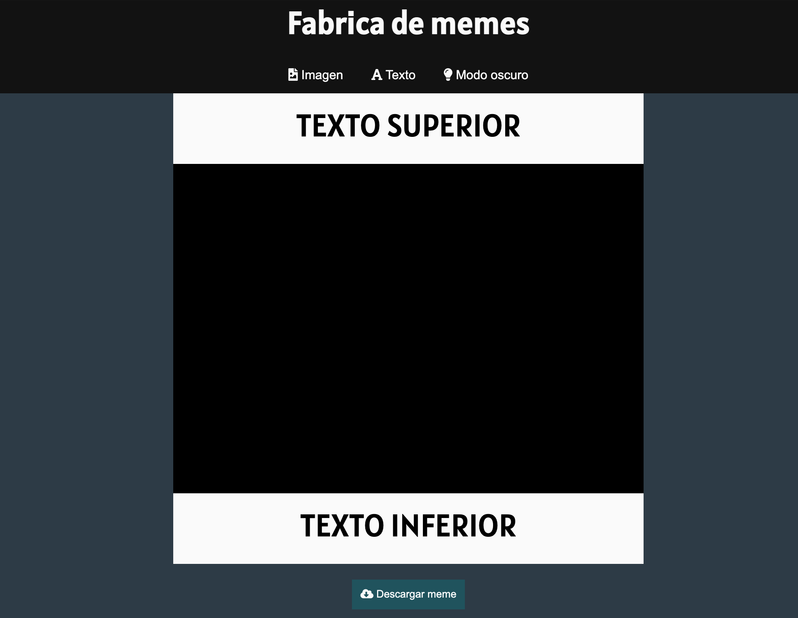

# Fábrica de memes

### ¡Hola! Este proyecto consiste en un generador de memes en el que podrás elegir fuentes, filtros, estilos y mucho más, a partir de la imagen que quieras convertir en un meme. Está construido con  **HTML**, **CSS** y **JavaScript**.

---

### Te invito a que lo conozcas haciendo click en este [enlace](https://flor2525.github.io/Generador-de-memes/)
---

## Descarga de código 💻
Para obtener el _código de este proyecto_ tenés que seguir estos pasos:

* Ir al [repositorio](https://github.com/flor2525/Generador-de-memes)
* Hacer click en el **botón fork**.
* Desplegar el **botón code** y copiar la URL.
* Abrir tu terminal y ejecutar el comando **git clone**, espacio y pega la URL que copiaste con anterioridad.
* Ubicate en la carpeta del proyecto y abrilo en tu IDE.

### ¡Listo! 💡
  

### 📍 Este proyecto no necesita la instalación de ninguna dependencia (por ahora).
---
 

### Así debería verse el proyecto:
 

 

---
### Agradezco a:
* Mi profe, [Jonh Parra](https://github.com/Jonhks), por hacer que aprecie tanto este lenguaje de programación.
* Mis compañeras de la 6ta generación Frontend de ADA por el acomompañamiento de siempre.
---

 

#### Hecho con 🧡 por Flor